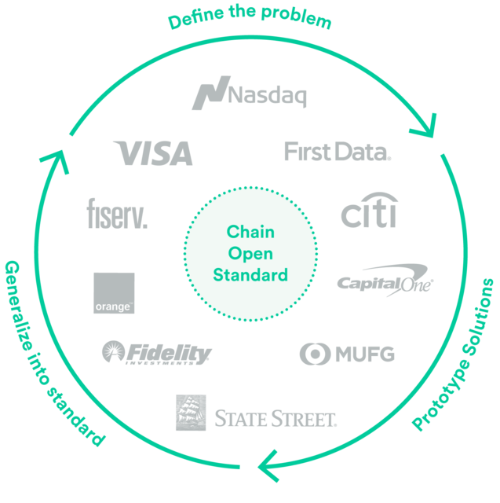
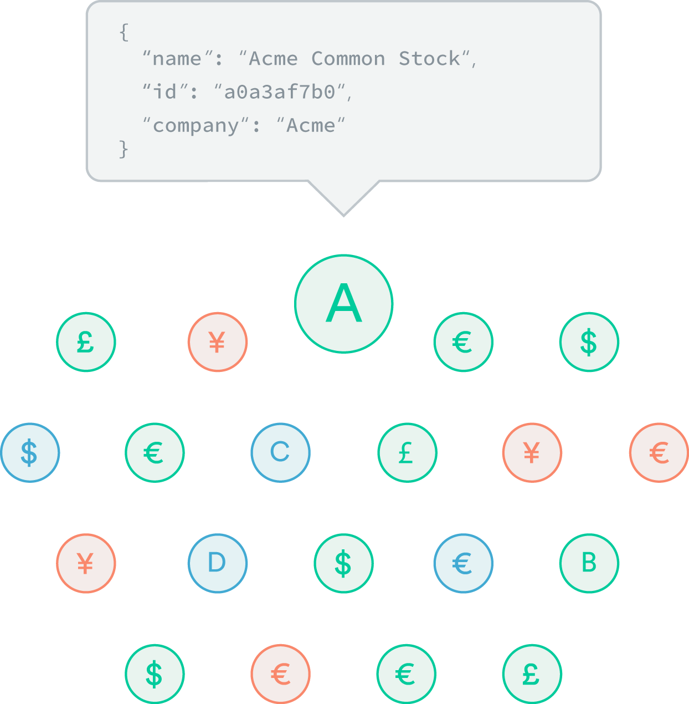
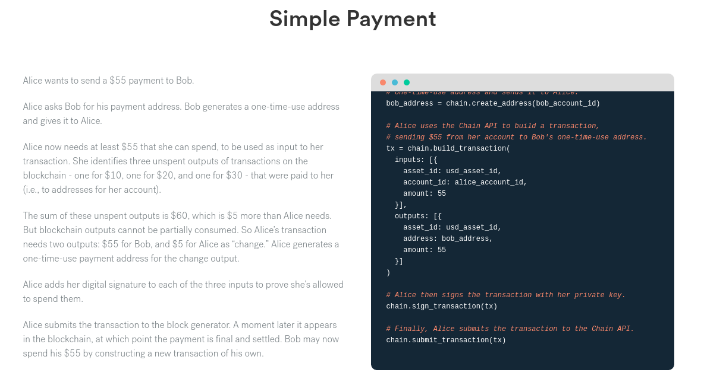

# 区块链的技术细节

Disclaimer: the content in this document was collected from my personal idea and information from open source community, specially Hyperledger at Github.com and Linux Foundations.

# 目录    
<!-- TOC depthFrom:1 depthTo:6 withLinks:1 updateOnSave:1 orderedList:0 -->

- [区块链的技术细节](#区块链的技术细节)
- [目录](#目录)
	- [1. 文档目标](#1-文档目标)
	- [2. 技术层面](#2-技术层面)
		- [2.1. R3CEV](#21-r3cev)
			- [2.1.1. Corda的主要特点](#211-corda的主要特点)
			- [2.1.2. 开发在银行的业务场景](#212-开发在银行的业务场景)
			- [2.1.3. 反对的声音](#213-反对的声音)
			- [2.1.4. 技术团队主要成员](#214-技术团队主要成员)
		- [2.2 Chain.com推出Chain Open Standard](#22-chaincom推出chain-open-standard)
		- [2.3. DAH收购Elevence Digital Finance](#23-dah收购elevence-digital-finance)
	- [3. HyperLedger Project的技术架构](#3-hyperledger-project的技术架构)
		- [3.1. 框架](#31-框架)
		- [3.2. 验证（身份，节点等）](#32-验证身份节点等)
		- [3.3. 共识机制（Byzantine Consensus/ 拜占庭容错）](#33-共识机制byzantine-consensus-拜占庭容错)
		- [3.4. 账本](#34-账本)
			- [3.4.1. BlockChain](#341-blockchain)
				- [3.4.1.1. Block](#3411-block)
				- [3.4.1.2. Block Hashing](#3412-block-hashing)
				- [3.4.1.3. NonHashData](#3413-nonhashdata)
			- [3.4.2. World State](#342-world-state)
		- [3.5. 合约（ChainCode）](#35-合约chaincode)
		- [3.6. 安全，认证与加密](#36-安全认证与加密)
			- [3.6.1. 分布账本，节点认证（validating peers）和会员认证（membership management）总体架构](#361-分布账本节点认证validating-peers和会员认证membership-management总体架构)
			- [3.6.2. Keys（公钥，私钥）身份和节点，加密（数据库和网络传输），业务安全（身份，角色）](#362-keys公钥私钥身份和节点加密数据库和网络传输业务安全身份角色)
			- [3.6.3. 访问控制(Access Control)](#363-访问控制access-control)
			- [3.6.4. 实时审计](#364-实时审计)
		- [3.7. 标准](#37-标准)
		- [3.8. 容量与运维](#38-容量与运维)
		- [3.9. 用例](#39-用例)
	- [4. 代码开发体系- 开源社区](#4-代码开发体系-开源社区)
		- [4.0. 哲学](#40-哲学)
		- [4.1. 让世界都成为你的团队（汇集世界的力量）](#41-让世界都成为你的团队汇集世界的力量)
		- [4.2. 软件设计的艺术（API经济）](#42-软件设计的艺术api经济)

<!-- /TOC -->

## 1. 文档目标    
阐述和分析包括R3CEV，Digital Asset Holdings (DAH)，Chain.com等区块链软件公司在区块链（BlockChain）技术层面的细节，和Hyperledger Project的技术架构与一些细节。

## 2. 技术层面
###  2.1. R3CEV
#### 2.1.1. Corda的主要特点
* Corda has no unnecessary global sharing of data: only those parties with a legitimate need to know can see the data within an agreement    
    Corda无需全网分享（账本）信息：只有在同一合约中和有合理需求的主体才可以看到

* Corda choreographs workflow between firms without a central controller    
    没有中心控制的工作流

* Corda achieves consensus between firms at the level of individual deals, not the level of the system    
    共识机制在合约个体之间，而非全网系统

* Corda’s design directly enables regulatory and supervisory observer nodes    
    设计涵盖合规法规的监管节点

* Corda transactions are validated by parties to the transaction rather than a broader pool of unrelated validators    
    交易的验证只发生在交易主体，而非无关的validators池

* Corda supports a variety of consensus mechanisms   
    支持多类型的共识机制    

* Corda records an explicit link between human-language legal prose documents and smart contract code    
    清晰记录，对应法律文件和智能合约代码

* Corda is built on industry-standard tools    
    标准设计    

* Corda has no native cryptocurrency    
    没有数字货币


Corda设计的五个维度： consensus（共识）, validity（交易验证）, uniqueness（唯一）, immutability（不可篡改）, and authentication（身份验证）

摘自R3CEV的CTO Richard Brown的blog:    

> Corda addresses these key points in distinct ways offering “different solutions for different problems.” Despite its focus on some of the same goals the team is “not building a blockchain” and they reject the idea that all data should be available to everyone.

Brown explains that financial agreements between institutions need more than just a basic consensus mechanism.    

> “We are not building a blockchain. Unlike other designs in this space, our starting point is individual agreements between firms (“state objects”, governed by “contract code” and associated “legal prose”). We reject the notion that all data should be copied to all participants, even if it is encrypted.” （我们不认同，即使在加密的情况下，所有的数据都需要在所有参与节点拷贝)    

#### 2.1.2. 开发在银行的业务场景    
[http://www.coindesk.com/r3-reveals-8-areas-of-focus-for-blockchain-bank-trials/](http://www.coindesk.com/r3-reveals-8-areas-of-focus-for-blockchain-bank-trials/)    
A consortium of over 40 financial institutions around the world is currently working on at least eight different proofs-of-concept (PoCs) to show how distributed ledgers can be used to streamline a wide range of transactions on Wall Street – and make them easier to regulate (更容易地监管).

####  2.1.3. 反对的声音    
According to the CEO of Overstock.com, Patrick Byrne, the new project is likely to slow down innovation within the bitcoin industry. The new consortium, he said, is just a means used by the Wall Street bankers to stifle innovation.

#### 2.1.4. 技术团队主要成员    
Name | Title and Background | Picture    
----|----|----    
James Carlyle | Chief Engineer, 来自Barclays |     
Mike Hearn | Lead Platform Engineer, 来自Google和比特币社区 | 
Ian Grigg | Cryptographer | 
Tim Swanson | Head of Research 著有：Great Chain of Numbers |     

### 2.2 Chain.com推出Chain Open Standard    
https://chain.com/os/    
与十家金融和电信企业协作，在2016年5月开发推出open- source并permissioned协议软件。    
取名：Chain Open Standard，或 Chain OS 1。    
产品目标：A Protocol（协议标准）for Financial Assets    
协作企业：Capital One, Citi, Fidelity, First Data, Fiserv, Mitsubishi UFJ, Nasdaq, Orange, State Street and Visa    

[http://www.coindesk.com/chain-open-standards-visa-citi-nasdaq-business/](http://www.coindesk.com/chain-open-standards-visa-citi-nasdaq-business/)    
“The Chain Open Standard is the product of a unique collaboration between some of the world's leading financial firms and a team of Silicon Valley engineers, cryptographers, and data scientists. We are designing a blockchain protocol by putting real financial use cases at the center of an iterative R&D process.”    
Chain.com Open Standard 是一款产品。它是由世界顶尖的金融公司和硅谷的工程师的独特组合，并且包括密码学家与数据科学家。我们正在设计一个BlockChain的在真实金融行业的标准。    

<!--     -->


* Assets Definition （资产定义）    
多维度签名，在交易流程中设定规范和限制    
<!--  -->
    

* 智能合约（案例之一。其他案例可以参考官方网站）    
    

* 私密 - one-time-use addresses, zero knowledge proofs, and encrypted metadata.    

* 数据标准(metadata)和数据模型(data model)    

* 无论文本，加密数据，和hashed数据全部可以追溯和审计    

* 针对合约，user-defined assets, 和 transactions with multiple inputs and outputs的优化    

* 共识机制- Simplified Byzantine Fault Tolerance (SBFT，简化拜占庭容错)

> 1. 首先一个block generator提交一个加入block的交易请求    
2. 其他block signers认可（ratify），并且签名    
3. 其他的network members在有足够signers数量的条件下，接受block的交易请求    
4. 生成新的block    
5. 交易结束。交易历史不可篡改     

(In SBFT, one designated block generator collects and validates proposed transactions, periodically batching them together into a new-block proposal. Other designated block signers ratify the proposed block with their signatures. All network members know the identities of the block signers and accept blocks only if signed by a sufficient number of signers. This ensures that competing transactions will be resolved, transactions will be final, and history cannot be rewritten.)

### 2.3. DAH收购Elevence Digital Finance    
[http://www.coindesk.com/digital-asset-acquires-elevence/](http://www.coindesk.com/digital-asset-acquires-elevence/)    

With the purchase deal, Digital Asset Holdings has also unveiled Digital Asset Modeling Language (DAML), the language developed for financial services as an alternative to Smart Contracts.    

During the past few months the startup has been working on integrating Elevence’s technology into its software. It will improve the company’s existing system by offering a new way to prove updates to a distributed ledger while keeping data private. Parties of the transaction don’t need to reveal the details of the agreement to third parties, as it can be processed only by the relevant participants.    
* DAH四月份收购瑞士的Elevence Digital Finance，主要编写证券，现金和衍生产品的智能合约
* 建立设置Digital Asset Modeling Language (DAML，数字资产模型语言)

## 3. HyperLedger Project的技术架构
### 3.1. 框架


### 3.2. 验证（身份，节点等）


###  3.3. 共识机制（Byzantine Consensus/ 拜占庭容错）    
默认配置（共识算法可以根据不同的业务需求调整），PBFT (practical byzantine fault tolerance) tolerates up to t<n/3 Byzantine validators (验证节点). (根据拜占庭容错机制，只要2/3验证节点确认的账本，即可成为标准账本。)    

Company | Consensus Management
----|----    
Cachin/IBM PBFT | https://www.zurich.ibm.com/~cca/papers/pax.pdf
Microsoft PBFT | [http://research.microsoft.com/.../mcastro/.../p398-castro-bft-tocs.pdf](http://research.microsoft.com/en-us/um/people/mcastro/publications/p398-castro-bft-tocs.pdf)
Redundant BFT | http://pakupaku.me/plaublin/rbft/report.pdf
Stellar Consensus | https://www.stellar.org/papers/stellar-consensus-protocol.pdf
Tendermint Consensus | http://tendermint.com/docs/tendermint.pdf

生产中可以同时灵活应用多个共识机制！

###  3.4. 账本
The ledger consists of two primary pieces, the blockchain and the world state. 账本包含两部分：   
* The blockchain/ 数据块（类似比特币的data block），记录交易和数据块间按时序链接（The blockchain is a series of linked blocks that is used to record transactions within the ledger.）
* The world state，存储在key- value数据库之中的，用于合约记录交易状态（The world state is a key-value database that chaincodes may use to store state when executed by a transaction.）

#### 3.4.1. BlockChain
##### 3.4.1.1. Block

每一个block都存有上一个block的hash，因此blockchain是连在一起的block。另外，一个block还包含两个信息：存储在block之中的交易列表（the list of transactions contained within the block）和交易执行之后状态的hash（the hash of the world state after executing all transactions in the block.）

```
message Block {
  version = 1;
  google.protobuf.Timestamp timestamp = 2;
  bytes transactionsHash = 3;
  bytes stateHash = 4;
  bytes previousBlockHash = 5;
  bytes consensusMetadata = 6;
  NonHashData nonHashData = 7;
}

message BlockTransactions {
  repeated Transaction transactions = 1;
}
```

##### 3.4.1.2. Block Hashing
在上面的block中，```previousBlockHash```，```transactionHash```和```stateHash``` 均是利用```SHA3 SHAKE256 algorithm``` (算法)
##### 3.4.1.3. NonHashData
Block中也有无需hash的数据，例如交易是否成功，交易ID，等
#### 3.4.2. World State

### 3.5. 合约（ChainCode）


* 生命周期管理

### 3.6. 安全，认证与加密
总的来说，区块链不仅利用了分布式账本和加密等独特技术，也利用了现有的安全技术（特别是在银行金融机构的数字安全），来保护区块链的数据安全。
#### 3.6.1. 分布账本，节点认证（validating peers）和会员认证（membership management）总体架构


#### 3.6.2. Keys（公钥，私钥）身份和节点，加密（数据库和网络传输），业务安全（身份，角色）


#### 3.6.3. 访问控制(Access Control)


#### 3.6.4. 实时审计

### 3.7. 标准
* API (Application Programming Interface)和CLI (Command Line Interface)
* 账本信息数据
* 加密算法    

### 3.8. 容量与运维
* 节点
* 磁盘
* 合约模板和变量

###  3.9. 用例
[https://github.com/hyperledger/hyperledger/wiki/Use-Cases](https://github.com/hyperledger/hyperledger/wiki/Use-Cases)   


## 4. 代码开发体系- 开源社区
### 4.0. 哲学
### 4.1. 让世界都成为你的团队（汇集世界的力量）
* Linux – 开源软件和创新的根基
* HyperLedger项目所在的Linux Foundation - 全球180+企业加入


### 4.2. 软件设计的艺术（API经济）
* Github.com – 用于代码版本控制(version control)，并且多团队的合作开发平台。仅仅区块链就有1300+个项目(截至2016年5月)


* Slack.com – 团队协作沟通平台(channel, direct message, file upload/ share, notif, and integration)

* Gerrit和Stackalytics.com


* StackOverflow.com –
